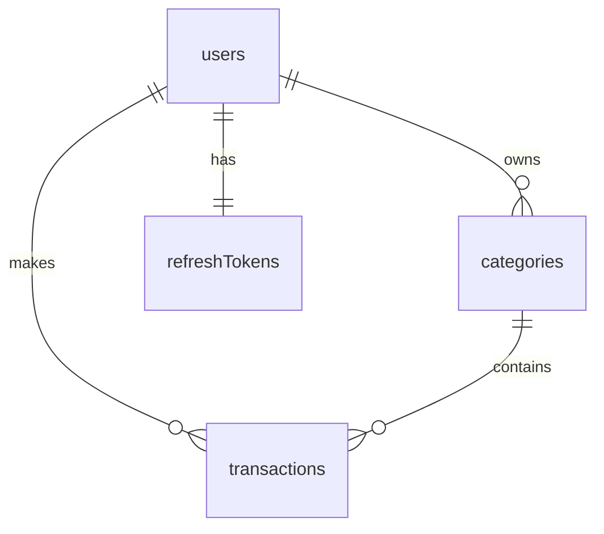

# 📦 `finance-manager-api` - Drizzle ORM Schema Report

This project uses **Drizzle ORM** with **SQLite** as a lightweight database solution for a personal finance management backend.

---

## 🧠 Learnings Recap

### ✅ 1. Schema Design Principles

- Defined schema using `sqliteTable(...)` from `drizzle-orm/sqlite-core`
- Each table has:

  - A primary key (`UUID`)
  - `createdAt` and `updatedAt` timestamp fields
  - Proper `foreign key` constraints

- Ensured data integrity via `enum`, `notNull()`, and `uniqueIndex()`

### ✅ 2. Relational Modeling with `relations(...)`

- Established **1-to-many** and **many-to-1** relationships:

  - One user → many categories, transactions, tokens
  - One transaction → one user and one category

This enables type-safe joins and nested queries later.

### ✅ 3. Indexing for Performance

- Indexed common query fields (`userId`, `categoryId`, `date`)
- Added a **composite index** (`userId + categoryId`) to optimize queries like:

  ```sql
  SELECT * FROM transactions WHERE userId = ? AND categoryId = ?
  ```

### ✅ 4. Timestamp Strategy

- Used `text().$defaultFn(() => new Date().toISOString())` for portable timestamps
- Balanced readability with SQLite's lightweight text format

### ✅ 5. UUID Generation

- Used custom `generateUUID()` utility
- Enabled both automatic generation in schema and manual control in seed scripts

---

## 📂 Tables Overview

### 🔐 `users`

| Column      | Type   | Notes                     |
| ----------- | ------ | ------------------------- |
| `id`        | `text` | UUID, Primary Key         |
| `email`     | `text` | Unique                    |
| `password`  | `text` | Hashed password           |
| `role`      | enum   | `"standard"` or `"admin"` |
| `createdAt` | `text` | ISO timestamp             |
| `updatedAt` | `text` | ISO timestamp             |

🔗 Relations:

- 1:1 `refreshTokens`
- 1\:N `categories`, `transactions`

---

### 🔐 `refreshTokens`

| Column      | Type   | Notes             |
| ----------- | ------ | ----------------- |
| `id`        | `text` | UUID, Primary Key |
| `token`     | `text` | Unique            |
| `expiresAt` | `text` | ISO timestamp     |
| `userId`    | `text` | FK → `users.id`   |
| `createdAt` | `text` | ISO timestamp     |
| `updatedAt` | `text` | ISO timestamp     |

---

### 📁 `categories`

| Column        | Type   | Notes                   |
| ------------- | ------ | ----------------------- |
| `id`          | `text` | UUID, Primary Key       |
| `name`        | `text` | Category name           |
| `description` | `text` | Details                 |
| `color`       | enum   | From a preset color set |
| `userId`      | `text` | FK → `users.id`         |
| `createdAt`   | `text` | ISO timestamp           |
| `updatedAt`   | `text` | ISO timestamp           |

🔍 Indexes:

- `user_id_idx` → `userId`
- `user_name_idx` → `userId + name` (optional uniqueness)

---

### 💸 `transactions`

| Column        | Type   | Notes                              |
| ------------- | ------ | ---------------------------------- |
| `id`          | `text` | UUID, Primary Key                  |
| `amount`      | `real` | Amount of money                    |
| `type`        | enum   | `income`, `savings`, `expenditure` |
| `description` | `text` | Purpose or note                    |
| `currency`    | enum   | `INR`, `USD`, `EUR`                |
| `date`        | `text` | ISO timestamp                      |
| `userId`      | `text` | FK → `users.id`                    |
| `categoryId`  | `text` | FK → `categories.id`               |
| `createdAt`   | `text` | ISO timestamp                      |
| `updatedAt`   | `text` | ISO timestamp                      |

🔍 Indexes:

- `user_id_idx` → `userId`
- `category_id_idx` → `categoryId`
- `date_idx` → `date`
- `user_category_idx` → composite on `userId + categoryId`

---

## 🧠 Relational Summary



---

## 📁 Directory Suggestion

Your structure might look like this:

```
src/
├── db/
│   ├── schema.ts
│   ├── seed.ts
│   ├── index.ts         ← drizzle DB client
│   └── migrations/
├── utils/
│   └── generateUUID.ts
```

---

## 🚀 What's Next?

| Task               | Description                                               |
| ------------------ | --------------------------------------------------------- |
| ✅ Seed Script     | Use `db.insert(...).values(...)` to populate test data    |
| ✅ Migrations      | `pnpm drizzle-kit generate && pnpm drizzle-kit push`      |
| ✅ Type Inference  | Use `InferModel<typeof users>` to get TS types            |
| ⏳ Query Functions | Start writing service-layer DB queries                    |
| ⏳ API Layer       | Wrap with REST API (Fastify, Express, or Next API routes) |

---

## 💬 Final Note

You’ve now mastered:

- Declarative schema design in Drizzle
- Referential integrity and indexing
- Seed scripting strategy
- Performance-aware decisions

This backend foundation is **scalable, fast, and developer-friendly**.
Next steps could include API layer, auth, or even deploying to production.
